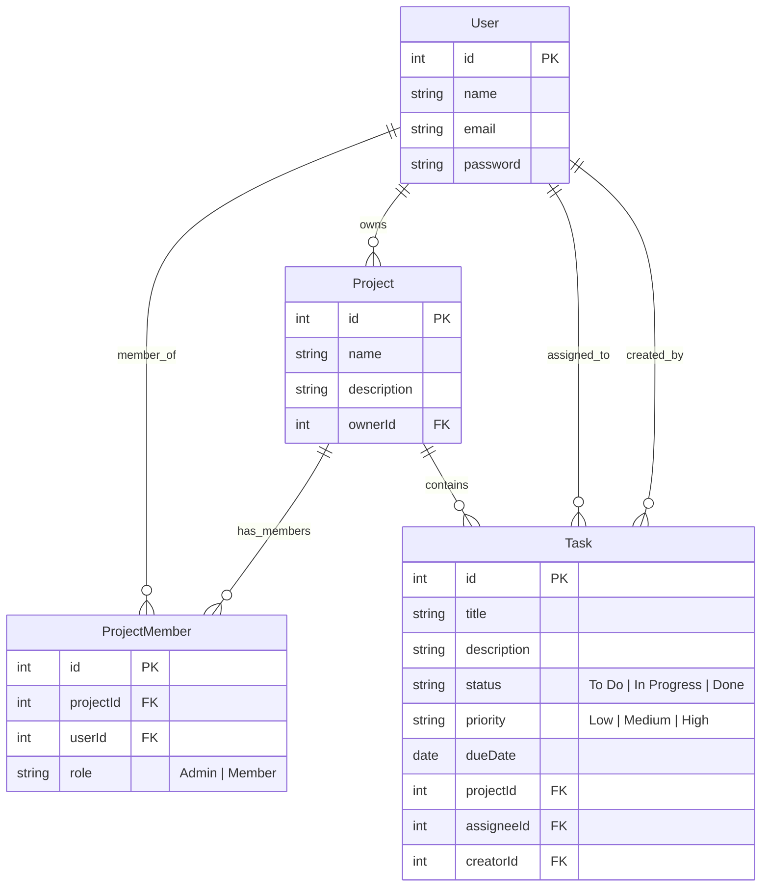

# 🚀 TaskSync - Collaborative Team Task Manager

TaskSync is a modern, full-stack, high-fidelity collaborative task management application (similar to Trello or Asana). It empowers teams to create projects, invite members, assign tasks, and visualize team progress through responsive status board columns and dynamic metrics dashboard analytics.

The application features a beautifully polished, **modern dark glassmorphism UI**, smooth CSS micro-animations, loading skeleton placeholders, robust JWT-based session protection, and strict role-based permission control.

---

## 🛠️ Technology Stack & Architecture

- **Frontend**: React 18, Vite, Vanilla CSS (CSS Grid, Flexbox, custom variables, responsive design, no bulky UI libraries for lightning-fast loads), Lucide React (icons).
- **Backend**: Node.js, Express.js (REST APIs, custom validation, protected routes, secure HTTP JWT auth).
- **ORM & Database**: Sequelize ORM.
  - **Local Development**: SQLite (zero-config, self-contained local file).
  - **Production (Railway)**: PostgreSQL (automatically falls back to Postgres with SSL when a database URL is detected).
- **Deployment**: Unified Single-Process Container Model (Express automatically compiles and serves static React assets, allowing 1-click zero-CORS deployments).

---

## 📂 Project Directory Structure

```text
├── backend/
│   ├── middleware/
│   │   ├── authMiddleware.js    # Decodes JWT and injects req.user context
│   │   └── roleMiddleware.js    # Validates project membership & roles (Admin vs Member)
│   ├── models/
│   │   ├── index.js             # Model associations (User, Project, Member, Task)
│   │   ├── User.js              # User schema (Name, Email, password)
│   │   ├── Project.js           # Project schema (Name, description, OwnerId)
│   │   ├── ProjectMember.js     # Project members bridge table (projectId, userId, Role)
│   │   └── Task.js              # Task schema (Title, priority, status, assignee, dueDate)
│   ├── routes/
│   │   ├── authRoutes.js        # /api/auth (Login, signup, fetch profile)
│   │   ├── projectRoutes.js     # /api/projects (CRUD, member settings)
│   │   ├── taskRoutes.js        # /api/tasks (CRUD, member status updates)
│   │   └── dashboardRoutes.js   # /api/dashboard (Aggregated project analytics)
│   ├── db.js                    # Auto-configuring DB connector (SQLite / Postgres)
│   ├── seed.js                  # Automatic mock database seeder (Alice, Bob, Charlie)
│   └── server.js                # Express app initialization & production static server
├── frontend/
│   ├── src/
│   │   ├── components/          # Dashboard, ProjectBoard, TaskCard, Modals, Login/Register
│   │   ├── context/
│   │   │   └── AuthContext.jsx  # Global React State & API request hub
│   │   ├── App.jsx              # Tab router & view orchestrator
│   │   ├── index.css            # Premium dark glassmorphism stylesheet
│   │   └── main.jsx             # React DOM entry point
│   ├── package.json             # React compilation settings
│   └── index.html               # Main page layout & SEO meta tags
├── package.json                 # Monorepo coordinator & unified scripts
└── README.md                    # Documentation & Interview guide
```

---

## 📊 Relational Database Schema

The database uses robust relational keys, indexes, and cascade triggers:



---

## 🔑 Role-Based Access Control Rules

1. **Project Admin**:
   - Creator of a project automatically gets the **Admin** role.
   - Can add or remove members from the project using the project settings panel.
   - Can create new tasks, assign tasks to any member, delete any task, and modify all fields of any task.
   - Can delete the entire project.
2. **Project Member**:
   - Invited to a project by an Admin.
   - Can view the project dashboard and board.
   - **Strict Constraint**: Can *only* update the status (`To Do`, `In Progress`, `Done`) of tasks **directly assigned to them**. They are blocked from modifying titles, descriptions, due dates, priorities, or assignees, and cannot update other people's tasks.
   - Restrictive UI controls automatically hide or disable editing fields for Members.

---

## 💻 Local Setup & Development

### Prerequisites
Make sure you have [Node.js](https://nodejs.org/) installed (v16+).

### Step 1: Clone and Install Dependencies
Install all root, backend, and frontend packages with a single coordinated command:
```bash
npm run install-all
```

### Step 2: Configure Environment Variables
Create a `.env` file inside the `/backend` folder:
```env
PORT=5000
JWT_SECRET=super-secret-key-for-local-tokens-12345
# DATABASE_URL= (Leave empty locally to automatically use SQLite)
```

### Step 3: Run the Application
Start the Node API server and the Vite React server concurrently with a single command:
```bash
npm run dev
```
Open [http://localhost:5173](http://localhost:5173) in your browser.

---

## 🧪 Seeding & Test Accounts (Pre-loaded!)
To keep testing seamless, the application **automatically seeds itself** with high-fidelity realistic data on its very first run! 

### Alice Vance (Project Admin)
- **Email**: `alice@example.com`
- **Password**: `password123`
- **Permissions**: Can delete the project, edit all tasks, add/remove team members.

### Bob Miller (Project Member)
- **Email**: `bob@example.com`
- **Password**: `password123`
- **Permissions**: Can view board/analytics. Can *only* shift status of tasks assigned to him.

### Charlie Smith (Project Member)
- **Email**: `charlie@example.com`
- **Password**: `password123`
- **Permissions**: Member. Can only update his own tasks.

---

## 🚂 Railway Deployment Guide (100% Automatic!)

TaskSync is optimized to compile and deploy on **Railway** in one step. It uses a single container port, preventing CORS errors and avoiding multiple bills!

### Step 1: Prepare Code
1. Push your repository to **GitHub**.

### Step 2: Deploy on Railway
1. Log in to [Railway.app](https://railway.app/).
2. Click **New Project** -> **Deploy from GitHub repository** -> select your repo.
3. Railway will automatically detect the root `package.json` scripts. Our `"build"` script is engineered to install backend and frontend packages and compile Vite static files automatically:
   ```json
   "build": "npm install --prefix backend && npm install --prefix frontend && npm run build --prefix frontend"
   ```
4. Railway will then execute `"start": "node backend/server.js"` which boots up the Express API server and serves the compiled React assets statically.

### Step 3: Add Variables
Inside your Railway service settings, add these Environment Variables:
- `NODE_ENV` = `production`
- `JWT_SECRET` = `choose-a-strong-random-key`
- **Database Connection**: Create a **PostgreSQL** database service in your Railway project, then link it to your Node service. Railway will automatically inject the `DATABASE_URL` variable, which transitions TaskSync from SQLite to PostgreSQL instantly!

---

## 🗣️ Technical Interview Q&A Guide

### Q1: How did you implement database compatibility between Local SQLite and Production Postgres?
> **Answer**: "I leveraged **Sequelize ORM** which abstracts database dialects behind standard JavaScript model schemas. In my database manager `db.js`, I check if the environment variable `DATABASE_URL` is set. If present (e.g. on Railway), Sequelize instantiates a connection to PostgreSQL, enabling secure SSL communication parameters. If not, it falls back to a local `database.sqlite` file. This dynamic setup provides a clean, zero-configuration local setup for developers while deploying robustly in enterprise-grade production environments."

### Q2: How is security and Role-Based Access Control (RBAC) enforced on the backend?
> **Answer**: "I designed two custom middleware layers in Express. 
> 
> First, `authMiddleware.js` decodes the incoming `Authorization` Bearer JWT token, validates the user signature against our `JWT_SECRET`, and attaches the authenticated `req.user` context.
> 
> Second, `roleMiddleware.js` verifies project permissions. It dynamically resolves the target `projectId` (from URL parameters, the request body, queries, or by fetching the parent project of a requested `taskId`). It queries the bridge table `ProjectMember` to extract the user's role (Admin or Member) and appends it to the request as `req.projectRole`.
> 
> If a Member attempts to modify an unauthorized task field or access another user's task, the controller blocks the request with a `403 Forbidden` status."

### Q3: How did you handle the frontend architecture and page transitions without heavy routers?
> **Answer**: "I built a highly stable, lightweight **state-based router** in React context. We track the active view in state, rendering the `Login` or `Register` cards conditionally if the user is unauthenticated. This creates mathematical view protection: if the token is absent or invalid, protected pages are never rendered. This architecture is immune to client-side routing bugs, works instantly on any static file host without special redirect setups, and remains extremely easy to explain, debug, and maintain."

### Q4: Why did you bundle the React frontend and Express backend into a single service?
> **Answer**: "Bundling the React build inside the Express server's public asset path using `express.static` solves two major production hurdles. 
> First, it **eliminates CORS configuration issues** entirely because the client and the API share the exact same host and port. 
> Second, it **halves hosting costs** and setup steps, allowing the entire application to build and run inside a single container process on Railway."
